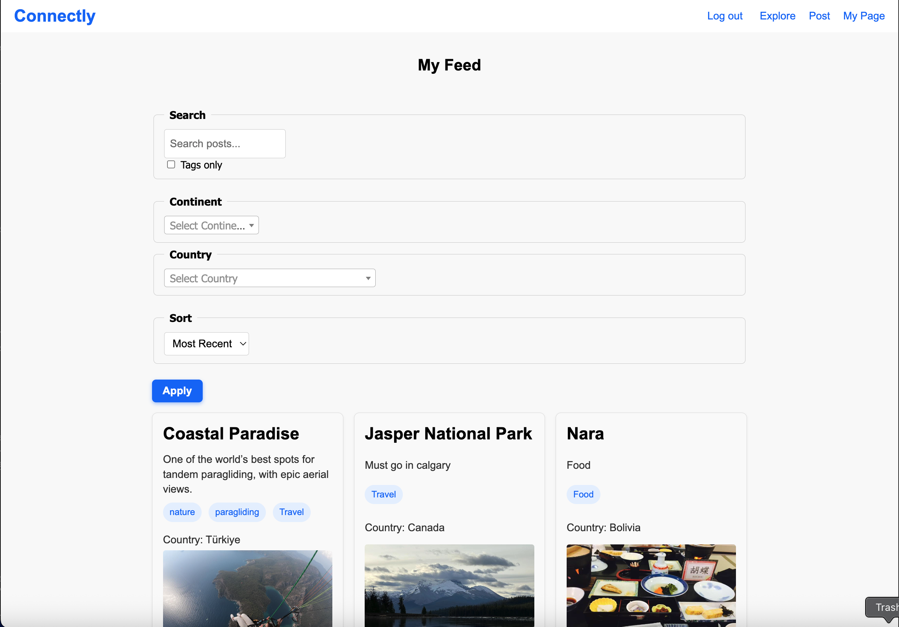
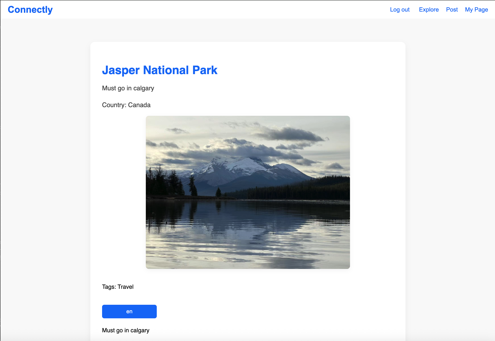
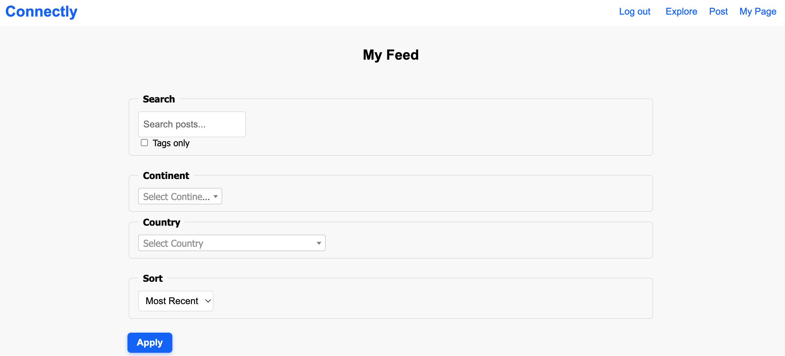
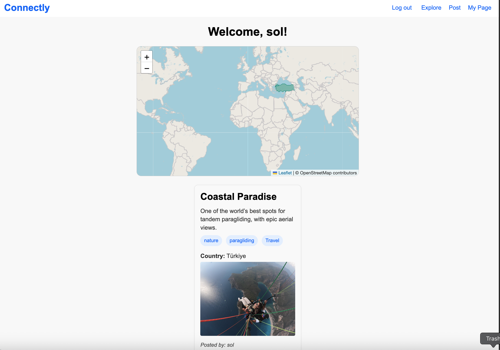

# 🤝 CONNECTLY

## Welcome to **Connectly – Where Shared Experiences Truly Connect!**

**Connectly** is a social storytelling web app where users can share personal stories, ideas, and inspiration — from travel and culture to lifestyle and local gems. Think of it as a digital wall of voices, where every post is a meaningful piece of a shared experience.

### 🌍 What You Can Do on Connectly

- 📝 Create and publish posts with text, tags, and images
- 🏷️ Browse by topics, countries, or categories
- 💬 Comment and engage with others' stories
- 📸 Share photos and meaningful experiences
- 🔍 Filter and search content by interest or region

---

## 💡 Why We Built It

We created **Connectly** to bring storytelling back to the heart of social interaction. While most platforms focus on trends and virality, Connectly is about **genuine expression**.

## ✨ What Users Can Do

📝 Share stories on topics they’re passionate about

📷 Upload personal photos, travel memories, and life moments

🏷️ Add tags to organize and surface content more easily

💬 Engage meaningfully with others through comments and shared experiences

---

## 📷 Screenshots

  
🏠 User Feed

  
📝 Post Detail Page

  
🔎 Filter/Search

  
🙋‍♀️ User Profile Page

---

## 🛠️ Technologies Used

- 
- 
- 
- 
- 

---

## 🚀 Getting Started

### 🔗 [Live App](https://connectly-2045c75feedb.herokuapp.com/)

---

## 📦 Third-Party Packages & Services

- **django-taggit** – Tagging system for posts
- **boto3 & django-storages** – Integration with AWS S3 for media storage
- **AWS S3** – Used for storing and serving uploaded images
- **AWS EC2** – Used for hosting Ollama
- **Deepseek** – Large language model
- **Leaflet.js** – For building interactive maps

---

## 🙌 Attributions

- **Favicon** : [Unsplash](https://unsplash.com)
- **Icons**: [Font Awsome](https://fontawesome.com/)

---

## 🌱 Next Steps

⭐ Follow storytellers & get notifications

💌 Private messaging (DMs)

❤️ Favorite/save posts to personal
